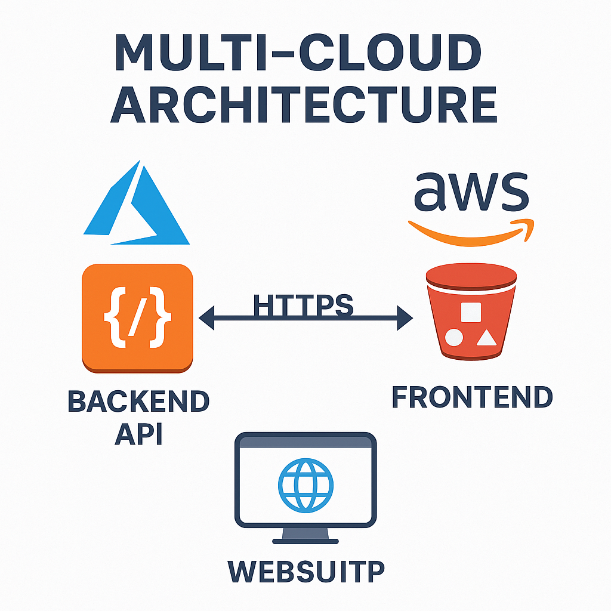

# 🌐 Multi-Cloud Web Application Deployment

**Intern Name**: Vanshika Goyal  
**Task**: Internship Task 3 – Multi-Cloud Architecture  
**Cloud Providers**: Microsoft Azure (Backend) + Amazon AWS (Frontend)

---

## 🔗 Live Demo Links

- 🔵 **Frontend (AWS S3)**:  
  [http://multi-cloud-frontend-vanshika.s3-website.ap-south-1.amazonaws.com](http://multi-cloud-frontend-vanshika.s3-website.ap-south-1.amazonaws.com)

- 🟠 **Backend (Azure App Service)**:  
  [https://multi-cloud-backend.azurewebsites.net/api](https://vanshika-flask-app-asfahuh6azazg9hk.northeurope-01.azurewebsites.net)

---

## 🎯 Objective

To design and implement a multi-cloud architecture where:
- The **backend API** is hosted on **Microsoft Azure**
- The **frontend website** is hosted on **AWS S3**

This setup demonstrates **interoperability** between two major cloud platforms using GitHub for version control and continuous deployment.

---

## 🧱 Architecture Overview
[User]
|
[Frontend - AWS S3 Static Site]
|
[HTTP Request → Azure API]
|
[Backend - Azure App Service]

- **Frontend**: Hosted on AWS S3 (HTML/JS)
- **Backend**: Flask API deployed on Azure App Service
- **Integration**: Frontend calls Azure API over HTTP

🖼️ Architecture Diagram:  

---

## 🚀 Deployment Steps

### 🔷 Backend (Azure App Service)
- Created Azure App Service with Python stack
- Connected GitHub repo (`multi-cloud-backend`) for CI/CD
- Live URL:  
  🔗 [https://multi-cloud-backend.azurewebsites.net](https://vanshika-flask-app-asfahuh6azazg9hk.northeurope-01.azurewebsites.net)

### 🟠 Frontend (AWS S3)
- Created public S3 bucket with static website hosting
- Uploaded `index.html`, `style.css`, and JS files
- Live URL:  
  🔗 [http://multi-cloud-frontend-vanshika.s3-website.ap-south-1.amazonaws.com](http://multi-cloud-frontend-vanshika.s3-website.ap-south-1.amazonaws.com)

---

## 📂 Repository Structure
multi-cloud-backend/
├── app.py # Flask backend
├── requirements.txt # Python dependencies
├── architecture-diagram.png # Draw.io diagram
├── Multi Cloud Documentation.docx
├── README.md
└── Screenshots

---

## 📄 Documentation

- [Multi Cloud Documentation.docx](./Multi%20Cloud%20Documentation.docx)
- [Architecture Diagram](./architecture-diagram.png)

---

## 🧰 Tools & Technologies Used

- Azure App Service
- AWS S3 (Static Hosting)
- Python (Flask)
- HTML/CSS/JS
- GitHub (Version Control + CI/CD)
- Draw.io (Architecture Diagram)
- Visual Studio Code + Terminal

---

## ✅ Outcome

Successfully deployed a full-stack web application using a **multi-cloud approach**. Demonstrated smooth integration of services across **Azure and AWS**, with GitHub-driven continuous deployment and public access.

---

## 🏁 Conclusion

This project highlights the flexibility and real-world power of using a multi-cloud strategy, enabling deployment resilience, cloud vendor diversity, and platform independence.

---

