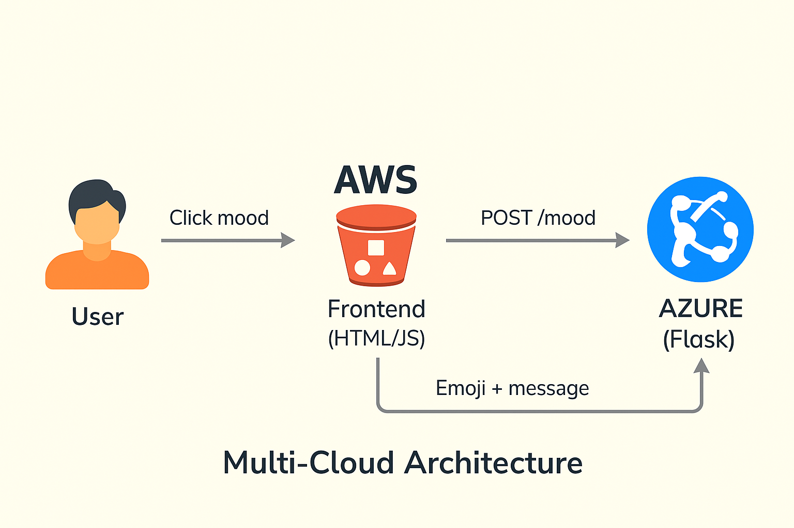

# 🌐 Multi-Cloud Web Application Deployment

**Intern Name**: Vanshika Goyal  
**Task**: Internship Task 3 – Multi-Cloud Architecture  
**Cloud Providers**: Microsoft Azure (Backend) + Amazon AWS (Frontend)

---
# 🧠 Emoji Mood Generator (Multi-Cloud App)

This is a fun and interactive project that demonstrates a **multi-cloud architecture** using **AWS S3** for the frontend and **Azure App Service** for the backend.

Users can select a mood and receive an emoji-based response with a motivational message. This showcases how two cloud platforms can work together in real time.

---

## 🔗 Live Demo

- 🎨 **Frontend (AWS S3)**  
  [http://multi-cloud-frontend-vanshika.s3-website.ap-south-1.amazonaws.com](http://multi-cloud-frontend-vanshika.s3-website.ap-south-1.amazonaws.com)

- ⚙️ **Backend (Azure App Service)**  
  [https://vanshika-flask-app-asfahuh6azazg9hk.northeurope-01.azurewebsites.net](https://vanshika-flask-app-asfahuh6azazg9hk.northeurope-01.azurewebsites.net)

---

## 🎯 Objective

To design and implement a multi-cloud architecture where:
- The **backend API** is hosted on **Microsoft Azure**
- The **frontend website** is hosted on **AWS S3**

This setup demonstrates **interoperability** between two major cloud platforms using GitHub for version control and continuous deployment.

---

## 🧱 Architecture Overview
[User]
|
[Frontend - AWS S3 Static Site]
|
[HTTP Request → Azure API]
|
[Backend - Azure App Service]

- **Frontend** (HTML/JS) hosted on **AWS S3 Static Website Hosting**
- **Backend** (Python Flask API) hosted on **Azure App Service**
- Communication via **HTTP POST request**

---

🖼️ Architecture Diagram:  

---

## 📦 Technologies Used

- Flask (Python)
- flask-cors for CORS support
- HTML, CSS, JavaScript
- AWS S3 (for hosting frontend)
- Azure App Service (for hosting Flask backend)
- GitHub (version control & CI deployment)

---

## 📁 Project Structure

multi-cloud-emoji-mood-app/
├── backend/
│ ├── app.py
│ └── requirements.txt
├── frontend/
│ └── index.html
├── architecture/
│ └── emoji-architecture.png
├── screenshots/
│ └── (UI and deployment screenshots)
├── Multi Cloud Documentation.docx
└── README.md

---

## 🚀 Deployment Steps

### 🔷 Backend (Azure App Service)
- Created Azure App Service with Python stack
- Connected GitHub repo (`multi-cloud-backend`) for CI/CD
- Live URL:  
  🔗 [https://multi-cloud-backend.azurewebsites.net](https://vanshika-flask-app-asfahuh6azazg9hk.northeurope-01.azurewebsites.net)

### 🟠 Frontend (AWS S3)
- Created public S3 bucket with static website hosting
- Uploaded `index.html`, `style.css`, and JS files
- Live URL:  
  🔗 [http://multi-cloud-frontend-vanshika.s3-website.ap-south-1.amazonaws.com](http://multi-cloud-frontend-vanshika.s3-website.ap-south-1.amazonaws.com/)

---

## 📄 Documentation

- [Multi Cloud Documentation.docx](./Multi%20Cloud%20Documentation.docx)
- [Architecture Diagram](./architecture-diagram.png)

---

## 🧰 Tools & Technologies Used

- Azure App Service
- AWS S3 (Static Hosting)
- Python (Flask)
- HTML/CSS/JS
- GitHub (Version Control + CI/CD)
- Draw.io (Architecture Diagram)
- Visual Studio Code + Terminal

---

## 📌 Features

- Click a mood → instantly receive an emoji + motivational reply
- Live communication between AWS and Azure
- Error-handled frontend and clean UI
- Modular code and multi-cloud practice

---

## ✅ How It Works

1. User opens AWS S3 hosted site and clicks a mood button
2. JavaScript sends a **POST** request to Azure Flask backend
3. Flask returns a JSON response with `emoji` and `message`
4. Frontend updates the UI live with response

---

## 📚 Learnings

- Setting up static frontend hosting on AWS S3
- Deploying Flask app to Azure with GitHub integration
- Handling CORS and cross-origin communication
- Real-time frontend-backend API interaction

---
## ✅ Outcome

Successfully deployed a full-stack web application using a **multi-cloud approach**. Demonstrated smooth integration of services across **Azure and AWS**, with GitHub-driven continuous deployment and public access.

---

## 🏁 Conclusion

This project highlights the flexibility and real-world power of using a multi-cloud strategy, enabling deployment resilience, cloud vendor diversity, and platform independence.

---

